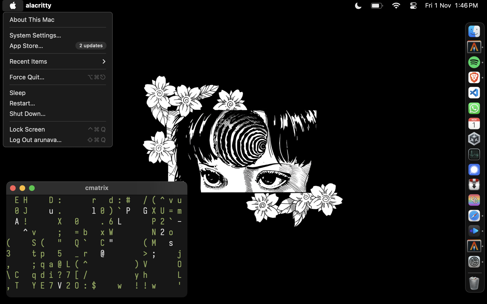

    <samp>
        <a href="https://github.com/vimfn/dots">i3</a> // 
        <a href="https://github.com/vimfn/dots/tree/bspwm">bspwm</a> // 
        <a href="https://github.com/vimfn/dots/tree/hyprland">hyprland </a> // 
        <a href="https://github.com/vimfn/dots/blob/i3/.config/nvim/init.lua">nvim</a>  //
        <a href="https://vimfn.in/uses">uses</a> // 
        <a href="https://github.com/vimfn/walls">walls</a>
    </samp>

 
 

 *Philosophy: My dotfiles should prioritize productivity and an efficient, fast workflow. They should be keyboard-driven, mostly using Vim keybinds. Repetitive tasks must be automated with shell scripts, and CLI tools must be preferred over GUI programs. Speed and responsiveness should always be prioritized over fancy, distracting colors and other bloat.*
